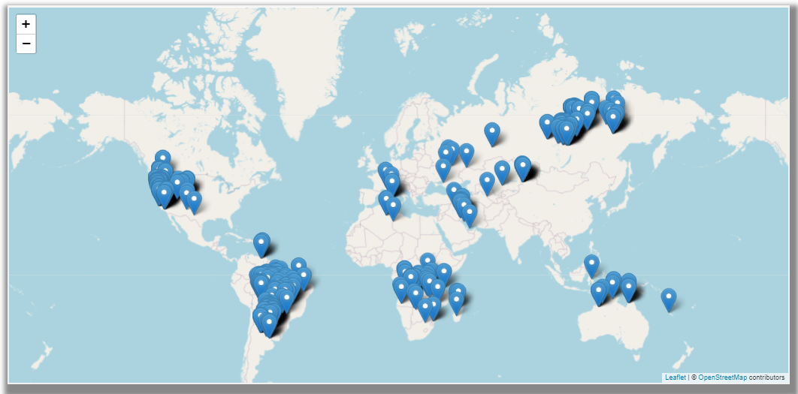

<!-- Logo -->
 

  

  <h3 align="center">Progetto Vue 2</h3>

 

<!-- Consegna -->
### Progetto

Ogni giorno da qualche parte nel mondo ha luogo un incendio.
Può essere provocato da diverse cause sia naturali che per mano dell'uomo.
La NASA così, da qualche anno, grazie ai suoi satelliti e per aiutare le autorità locali,
monitora la situazione globale, e in maniera del tutto automatica identifica e segnala gli incendi sull’intero pianeta.

Quello che dovrai fare è creare una mappa in Vue.js e inserire dei pin (marker) sulla coordinata dove è stato segnalato l’incendio.

Ho salvato per te i risultati della NASA nella settimana dal 21 al 28 agosto 2020.
Da questo link potrai vedere alcuni degli incendi di quel periodo, utili ai fini del progetto.

Ecco i dettagli:

Sviluppiamo una piccola applicazione web, che mostri su mappa gli incendi di questi 7 giorni.
Dovrai eseguire una chiamata ajax verso questo link (https://storage.googleapis.com/public.storykube.com/start2impact/fires.json)
e ciclare tutte le coordinate.

Per ogni coordinata dovrai inserire un pin o marker su mappa.

In più, selezionando una singola giornata tra 21 e il 28 agosto,
la mappa mostrerà solo i pin (gli incendi) di quella data.
 

<!-- Bonus -->

## Bonus

Vuoi una prova? Secondo te è più semplice trovare un bug in un codice
complesso e articolato o in un codice elegante pulito ed essenziale?
Qui gioca la tua creatività.
Hai pochi strumenti a disposizione:

*Ogni Vue file non deve superare le 400 righe compreso il css
*Se separi il css, cerca di non andare oltre le 150/200 righe nel tuo
componente.
*Non superare il numero di 5 o 6 componenti (file .vue) nel tuo progetto.
*Qualora non sia possibile: è preferibile che tu superi il numero di componenti
riducendo però drasticamente il numero di righe in ciascuno di essi.
 
Riuscirai con poco a scrivere il codice perfetto?
 

<!-- Leaflet -->

## Vue Leaflet

In questo progetto ho utilizzato la libreria Vue2Leaflet che mi
ha permesso, con poche righe di codice, di visualizzare una
mappa sul mio sito e di poter visualizzare i ping ottenuti dalla
chiamata ajax

  

 

<!-- Components -->

## Components

Ho cercato di utilizzare meno Components possibili e sono riuscito ad utilizzarne principalmente due
(esclusi i Components importati dalla libreria Leaflet) :
*Layout : che si occupa dell'aspetto grafico dell'applicazione , il suo scopo è puramente estetico (63 righe)
*Map : si occupa di implementare la mappa e fare la chiamata ajax al link fornito (125 righe)

<!-- Aggiungi dimostrazioni -->
 
<!-- Conclusione -->

## Conclusione

Inizialmente quando ho letto la consegna di questo progetto mi ero spaventato,
ma alla fine ho capito che con calma, ordine e determinazione risulta più semplice di quanto immaginassi.
La semplicità e l'ordine del mio codice (principalmente dovuto a Vue-Cli) mi permetterà in futuro di poter modificare
l'applicazione in modo facile e veloce andando a modificare direttamente i frammenti di codice interessati.
